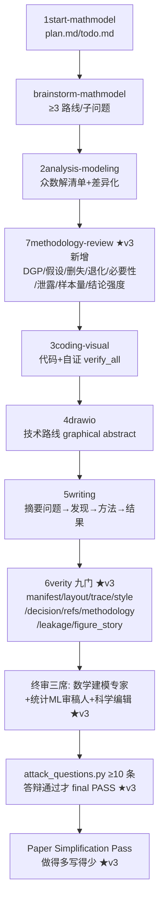

# MathModel Agent v3 工作流（2026 升级版）

基于 `优化/请基于当前 _mathmode.docx` 的系统级升级说明。核心变化：新增 **7methodology-review 强制阶段**、
6verity 由六门扩为**九门**、图/摘要/粗体/评审全面 v3 化。

## 一、阶段流水线

## 二、7methodology-review（新阶段）产出

`reports/methodology/` 下 7 个 JSON（缺一即 methodology 门 strict FAIL）：

| 文件 | 内容 | 对应 spec |
|---|---|---|
| data_generating_process.json | 分析单位/重复测量/组内相关/删失/缺失/测量误差/类别不平衡/时间依赖 | 一 |
| statistical_assumptions.json | independence/条件独立/方差齐性/分布/删失假设/缺失机制/随机效应结构 | 二 |
| censoring_report.json | 删失分类 + 候选模型（Turnbull/interval Weibull/log-normal/AFT）+ 插值近似标注 | 三 |
| optimization_degeneracy.json | objective/constraint/full 三角对比 + active/dominance/sensitivity | 四 |
| model_necessity.json | Primary/Baseline/Robustness/Rejected 分类 + 内容份额 60-20-20 | 五 |
| ml_operation_scope.json | 每步 ML 操作的 allowed_data（training_fold/inner_cv/outer_test） | 六、七 |
| sample_sizes.json | 分组 n/事件/删失/CI 宽度 + minimum_group_n/exploratory | 八 |

## 三、6verity 九门

原六门（manifest/layout/trace/style/decision/refs）+ v3 三门：
- **methodology**：DGP/假设一致性（重复测量×「相互独立」违规 FAIL）/Censoring/退化/必要性/样本量/结论强度
- **leakage**：ml_operation_scope 登记核验（阈值=inner_cv 强制）+ 论文泄漏表述 FAIL + 代码启发式 WARN
- **figure_story**：Figure Story manifest 必填 main_message + 正文引用覆盖 + 主图数量/冗余对

阈值单一事实源 = `style_policy.json`；`official_rules.json`（官方硬规则）与
`recommended_style.json`（推荐风格）为分类视图，禁止把推荐风格表述为官方规定。

## 四、写作与可视化 v3 规则摘要

- **摘要**：结构 = 问题 → 关键发现 → 核心方法 → 最终结果；每问模型名 ≤1–2 个；禁止连续模型缩写报菜名。
- **粗体 v2**：每问 ≤1 个核心粗体短语；禁止单独加粗 p/r/R²/CI/SE/模型缩写/裸数字；正文一段 ≤1 处内容性粗体。
- **可视化**：五色系统（深蓝主模型/橙红风险/中灰对照/浅灰背景/青绿第三强调）；图标题写结论、图注写方法；
  forest plot 统一系数语言；direct labeling 替代 legend；去 top/right spine、无垂直网格、水平网格极淡。
- **Figure Story**：每张主图先登记 main_message/panels/unique_information（figure_story 门强制）。
- **三类终审**：A 数学建模专家（抽象/优化/必要性）B 统计 ML 审稿人（独立性/删失/泄露/阈值/CI/过拟合）
  C 科学编辑视觉（摘要/图/表/粗体/30 秒理解）；8 维打分表与 ≥70 规则不变。
- **纪律**：每个新增方法必须回答「解决了哪个现有方法无法解决的问题？」；回答不了就不加。
