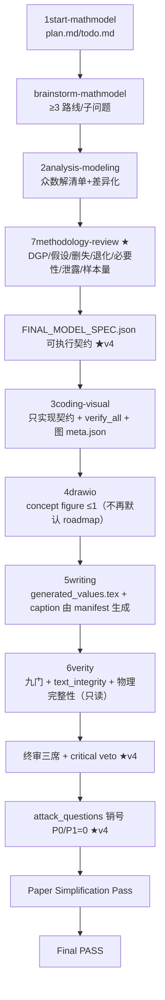

# MathModel Agent v4 工作流（2026-08 整改版）

> 工作流版本：**v4.0**。阶段顺序唯一事实源 = 仓库根 `workflow_spec.yaml`（`version: 4`）。
> **本文件与 README 的阶段表由该 spec 生成/校验**（`python skills/6verity/scripts/workflow_spec.py --check`），
> 禁止在任意文档中另写一份工作流顺序。

## 一、v4 核心变化（对应 优化/v2.txt 整改任务书）

从"声明式验收（九门 PASS）"升级为"**端到端可证明验收**"：

> 模型定义、实际代码、结果文件、图中数据、正文表述、最终 PDF 六层完全同源且相互可验证。

| 层 | v3 | v4 |
|---|---|---|
| 工作流定义 | 1start/persona/README/decision_log 四处手写 | `workflow_spec.yaml` 单一事实源 + `--check` 一致性校验 |
| 模型定义 | 7methodology 产审查结论，code 仍读 ANALYSIS_MODELING_REPORT | `reports/FINAL_MODEL_SPEC.json` 可执行契约；3coding 只实现契约；结果 JSON 写 `model_spec_sha256` |
| 方法学审查 | 全文关键词匹配（有 Turnbull 词即过） | 逐问题逐目标变量：同一 outcome 跨问题机制不一致 → FAIL；每问题章节必须出现契约证据词 |
| 数值来源 | trace 按"数字相等"匹配 | `paper/generated_values.tex` 由 results/*.json 生成，论文写命令不写裸数字 |
| 图来源 | 按 mtime 判定新鲜度 | `figures/*.meta.json`：generator+source_hash+annotation keys，按 key 追溯 |
| Panel 完整性 | 只审声明不审图 | Figure Integrity：面板 artist 计数 ≥ min_artist_count，空白面板 FAIL |
| 单位 | 图内可自写 ylabel 忘乘 100 | `reports/variables.json` 单位注册；FigureBuilder 强制 unit transform |
| 重复图 | 冗余对 WARN | `supersedes` 声明；旧图仍在正文 → FAIL |
| 物理排版 | layout_audit 存在但未进聚合 | layout_gate 内嵌物理越界检查（表裁切/图越界/行重叠进聚合门） |
| 文本完整性 | 无 | text_integrity 门：图 ??/表 ??/undefined ref/关键词未分隔/TODO/overfull |
| 验证器 | 会改 decision_log.last_updated | **完全只读**（writer updates, verifier verifies） |
| 规则分层 | style_policy 硬带（摘要 600–900、粗体 5–15%） | 每条规则带 severity（must/recommended/diagnostic），只允许 official must 硬 FAIL |
| 测试 | NIPT 作为无条件 golden PASS | immutable fixtures + 12 类负向 regression（bad 全 FAIL / good 全 PASS） |

## 二、阶段流水线（来源 workflow_spec.yaml）

## 三、FINAL_MODEL_SPEC.json（v4 关键产物）

见 `docs/FINAL_MODEL_SPEC.schema.md`。要点：

- 每个问题：analysis_unit / outcome(id,type,unit) / observation_mechanism(左/区间/右删失) /
  primary_model / likelihood / likelihood_evidence / covariates / excluded_covariates /
  validation / result_keys / figure_ids / paper_section。
- **同一 outcome.id 跨问题观察机制必须一致**（不一致需 `mechanism_change_rationale` 非空），
  methodology 门自动抓"Q2 区间删失 / Q3 精确事件+右删失"类 false-pass。
- 结果 JSON 必须写 `model_spec_sha256`；论文引用同一契约（`contract_rev`）。

## 四、6verity 门禁（v4 清单，来源 workflow_spec.yaml gates_pipeline）

1. **project_manifest**（artifact 清单 + 哈希）
2. **layout_gate**（源引用 + 有效字号 + 新鲜度 + **内嵌 layout_audit 物理越界**）
3. **text_integrity**（v4 新门：`图 ??`/`表 ??`/`式 ??`/TODO/TBD/PLACEHOLDER/待补 +
   `.log/.aux` 的 undefined reference/citation、multiply-defined labels、overfull）
4. **trace_numbers**（v4：支持 paper/generated_values.tex 命令溯源；白名单带 context）
5. **style_audit**（v4：severity 分层，推荐规则不硬 FAIL；摘要长度/粗体率 → WARN/visual）
6. **check_decision_log**（stages 从 workflow_spec 加载）
7. **verify_refs**（+ method_citation_map 核心方法引用检查）
8. **methodology**（v4：per-problem 契约审查 + 条件必需输入：有删失→censoring_report；
   optimization→degeneracy；supervised_ml→ml_operation_scope）
9. **leakage**（v4：运行时 fold provenance + `results/leakage_audit.json` 实际执行证据）
10. **figure_story**（v4：合并 figures/figure_manifest.json 唯一清单 + panel integrity +
    annotation-key trace + supersedes 硬 fail + caption 一致性）

聚合器内置 `workflow_order` 检查（decision_log 执行历史 = spec 顺序，不一致总体 FAIL）。

## 五、写作与可视化 v4 规则新增

- **数值**：论文不再手抄关键数字，使用 `paper/generated_values.tex`（由 results/*.json 生成，
  `\newcommand{\QTwoGTwoLow}{14.2}` 类命令）；trace 按命令来源 key 校验。
- **caption**：由 figure manifest（panel 定义 + 描述）生成，禁止"图由代码定义 panel、caption 再由模型手写"。
- **图表纪律**：只画满足 Figure Story 的最少充分图表；概念图 ≤1；每张正式图带 `.meta.json`
  （generator 哈希 + source_results 哈希 + annotations 的 value_key 绑定）。
- **失效传播**：FINAL_MODEL_SPEC.contract_rev 变化 → 依赖该模型的摘要/方法/结果/小结/
  优缺点/灵敏度/结论段落标记 stale（各节可声明 `depends_on`），必须重生成或人工确认。
